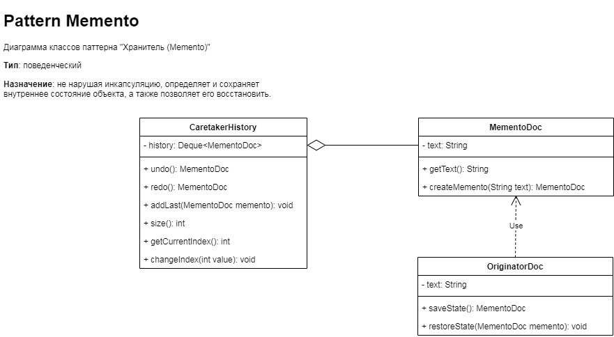

# `Домашнее задание 2`

## `Задача:`
Разработать UML-диаграмму для демонстрации работы шаблона (ОДНОГО, ЛЮБОГО ИЗ СПИСКА) проектирования Singleton, Builder, Adapter, Facade, Decorator, Proxy, Observer, Mediator ИЛИ ЛЮБОГО ДРУГОГО НА ВАШ ВЫБОР (как мы это делали на семинаре).  

2**. Продемонстрировать работу этого шаблона проектирования в вашей программе (как мы это делали на семинаре).

## `Описание решения:`
Для выполнения задания был применен паттерн [Memento/Хранитель](https://ru.wikipedia.org/wiki/%D0%A5%D1%80%D0%B0%D0%BD%D0%B8%D1%82%D0%B5%D0%BB%D1%8C_(%D1%88%D0%B0%D0%B1%D0%BB%D0%BE%D0%BD_%D0%BF%D1%80%D0%BE%D0%B5%D0%BA%D1%82%D0%B8%D1%80%D0%BE%D0%B2%D0%B0%D0%BD%D0%B8%D1%8F)).  

UML-диаграмма классов для паттерна Memento представлена на схеме:

Для демонстрации работы паттерна разработан текстовый редактор, который позволяет сохранять несколько состояний текста с возможностью перемещения/возврата к выбранному состоянию.

Текстовый редактор включает в себя компоненты: *MementoDoc*, *OriginatorDoc* и *CaretakerHistory*. В компоненте *CaretakerHistory* реализован механизм на основе очереди Deque, позволяющий сохранять новые состояния документа в очередь и переключаться между состояниями как назад для отмены действия пользователя, так и вперед для возврата отмененного действия. При этом количество сохранений состояния документа не ограничено разработчиком (но возможно стоит ограничить количество сохранений состояния документа, например до 16). Также в компоненте *TextEditor* реализован пользовательский интерфейс, позволяющий добавлять блок текста в документ, отменять последнее действие, возвращать отмененное действие и завершать работу с программой.

# `Описание работы компонент`

## Компонента OriginatorDoc.java содержит в себе:
1. Приватное поле *text* и служит для хранения текста.
2. `void append(String text)` служит для добавления новых блоков текста и хранения текста в переменной *text*.
3. `void print()` служит для вывода текста на дисплей.
4. `MementoDoc saveState()` служит для создания нового сохранения состояния текста.
5. `void restoreState(MementoDoc memento)` служит для восстановления текста из передаваемого методу сохраненного состояния *memento*.

## Компонента MementoDoc.java (memento, хранитель) содержит в себе:
1. Приватное поле *text* и служит для хранения текста.
2. Конструктор `MementoDoc(String text)` непосредственно служит для создания нового сохранения состояния текста в момент вызова конструктора.
3. `String getText()` возвращает текст.

## Компонента CaretakerHistory.java (caretaker, опекун) содержит в себе:
1. Приватные поля *history* и *currentIndex* служат для хранения очереди сохраненных состояний текста, а также индекса текущего сохраненного состояния.
2. Конструктор `CaretakerHistory()` служит для создания двусторонней очереди для хранения состояний текста и возможности выбора нужного состояния.
3. `void changeIndex(int value)` служит для изменения индекса текущего сохранения при перемещении между сохраненными состояниями в очереди. В метод передаются значения: 1 для перемещения вперед, -1 для перемещения назад между элементами в очереди.
4. `int getCurrentIndex()` возвращает текущий индекс сохранения состояния в очереди.
5. `void addLast(MementoDoc memento)` служит для добавления сохранения состояния текста *memento* в конец очереди, при этом индекс текущего сохранения увеличивается на 1. Кроме того, если до момент добавления нового сохраненного состояния производилась отмена действий пользователя, соответствующие сохраненные состояния, хранящиеся в начале очереди, удаляются.
6. `MementoDoc undo()` служит для отмены последнего действия пользователя и вызова предыдущего сохранения для восстановления текста. При этом последнее сохранение перемещается в начало очереди для возможности его использования в случае вызова метода MementoDoc redo(). Таким образом, метод возвращает предпоследнее состояние текста для восстановления.
7. `MementoDoc redo()` служит для возврата последнего отмененного пользователем действия и восстановления текста. Соответствующее последнее изменение переносится из начала очереди в конец и возращается методом для дальнейшего восстановления текста.
8. `int size()` возвращает количество элементов очереди в момент обращения к методу.

## Компонента Program.java содержит в себе:
1. Точку входа *main(String[] args)*.
2. Вызов метода `TextEditor.run()` для запуска работы текстового редактора.

## Компонента TextEditor.java содержит в себе:
1. Создает экземпляр классов *OriginatorDoc()* и *CaretakerHistory()*.
2. Интерфейс пользователя, позволяющий:
* добавлять новый блок текста;
* отменять последнее действие (несколько раз);
* возращать отмененное действие;
* завершать работу с программой.
